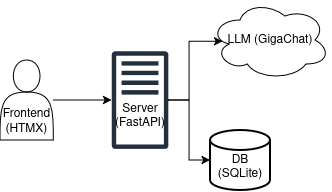

# Архитектура и стек

## Схема

## Компоненты

### Backend
- **Python 3.11+**
- **FastAPI** — веб-фреймворк
- **SQLAlchemy** — ORM для работы с базой данных
- **SQLite** — лёгкая реляционная база данных (для MVP)
- **Jinja2** — шаблонизатор для генерации HTML на сервере
- **python-docx** — извлечение текста из DOCX-файлов
- **pypdf** — извлечение текста из PDF-файлов
- **GigaChat API** — генерация планов уроков и раздаточных материалов

### Frontend

- **HTMX** — динамическое обновление страниц без написания JavaScript
- **TailwindCSS** — утилитарный CSS-фреймворк
- **Toast UI Editor** — WYSIWYG-редактор с поддержкой Markdown
- **KaTeX** — рендеринг LaTeX-формул

## База данных

В качестве СУБД для MVP используется **SQLite** с асинхронным драйвером `aiosqlite`. Выбор обусловлен нулевой стоимостью развёртывания, отсутствием необходимости в отдельном сервисе и достаточной производительностью для нагрузки прототипа. Архитектура спроектирована с использованием SQLAlchemy ORM, что позволяет без изменения кода переключиться на PostgreSQL при необходимости масштабирования.

### Таблицы

#### users
Хранит учетные записи пользователей.

| Поле | Тип | Описание |
|------|-----|----------|
| `id` | INTEGER | Первичный ключ |
| `username` | VARCHAR(50) | Уникальное имя пользователя |
| `email` | VARCHAR(100) | Уникальный email |
| `hashed_password` | VARCHAR(200) | Хеш пароля (bcrypt) |
| `is_active` | BOOLEAN | Флаг активности учетной записи |
| `created_at` | DATETIME | Дата регистрации |

**Индексы:** `username`, `email`

---

#### projects
Хранит проекты (раздаточные материалы), созданные пользователями.

| Поле | Тип | Описание |
|------|-----|----------|
| `id` | INTEGER | Первичный ключ |
| `user_id` | INTEGER | Внешний ключ → `users.id` |
| `name` | VARCHAR(200) | Название проекта |
| `status` | ENUM | Статус проекта: `plan_generation`, `handout_generation`, `editing`, `completed`|
| `context_json` | JSON | Контекст проекта (тема, класс, предмет, исходный текст плана и т.д.) |
| `share_token` | VARCHAR(100) | Уникальный токен для публичного доступа |
| `created_at` | DATETIME | Дата создания |
| `updated_at` | DATETIME | Дата последнего обновления |
| `last_accessed_at` | DATETIME | Дата последнего открытия |

**Индексы:** `user_id`, `share_token`

**Связи:** Один пользователь может иметь много проектов. При удалении пользователя каскадно удаляются его проекты.

---

#### handouts
Хранит отдельные раздаточные материалы, привязанные к этапам урока внутри проекта.

| Поле | Тип | Описание |
|------|-----|----------|
| `id` | INTEGER | Первичный ключ |
| `project_id` | INTEGER | Внешний ключ → `projects.id` |
| `stage_order` | INTEGER | Порядковый номер этапа в уроке |
| `stage_name` | VARCHAR(200) | Название этапа (из плана или пользовательское) |
| `stage_description` | TEXT | Описание этапа (цель, тип деятельности) |
| `handout_type` | ENUM | Тип раздатки: `work_sheet`, `memo`, `table`, `scheme`, `reflection`, `cards`, `other` |
| `content` | TEXT | HTML/Markdown-контент раздатки |
| `status` | ENUM | Статус генерации: `pending`, `generating`, `ready`, `error` |
| `error_message` | TEXT | Текст ошибки (если `status = error`) |
| `generated_at` | DATETIME | Дата и время генерации |
| `version` | INTEGER | Номер текущей версии (inc для истории) |
| `created_at` | DATETIME | Дата создания записи |
| `updated_at` | DATETIME | Дата последнего обновления |

**Индексы:** `project_id`, (`project_id`, `stage_order`)

**Связи:** Один проект может содержать много раздаток. При удалении проекта каскадно удаляются все его раздатки.

---

#### handout_versions
Хранит историю изменений раздаточных материалов (для реализации `undo/redo` и восстановления предыдущих версий).

| Поле | Тип | Описание |
|------|-----|----------|
| `id` | INTEGER | Первичный ключ |
| `handout_id` | INTEGER | Внешний ключ → `handouts.id` |
| `version_number` | INTEGER | Номер версии (возрастает для каждого `handout_id`) |
| `content` | TEXT | Снапшот контента на момент версии |
| `changed_by` | VARCHAR(50) | Кто изменил: `user` (через WYSIWYG) или `ai` (при регенерации) |
| `created_at` | DATETIME | Дата создания версии |

**Индексы:** `handout_id`

**Связи:** Одна раздатка может иметь много версий. При удалении раздатки каскадно удаляются все её версии.

---

#### uploaded_files
Хранит загруженные пользователями файлы (планы уроков, изображения для OCR).

| Поле | Тип | Описание |
|------|-----|----------|
| `id` | INTEGER | Первичный ключ |
| `project_id` | INTEGER | Внешний ключ → `projects.id` |
| `original_filename` | VARCHAR(255) | Оригинальное имя файла |
| `file_size` | INTEGER | Размер в байтах |
| `mime_type` | VARCHAR(100) | MIME-тип файла |
| `file_data` | LONGBLOB | Бинарные данные файла (для MVP) |
| `extracted_text` | TEXT | Извлечённый текст (результат парсинга или OCR) |
| `processing_status` | VARCHAR(50) | Статус обработки: `pending`, `processing`, `completed`, `failed` |
| `processing_error` | TEXT | Текст ошибки при обработке (если есть) |
| `created_at` | DATETIME | Дата загрузки |

**Индексы:** `project_id`

**Связи:** Один проект может иметь много загруженных файлов. При удалении проекта файлы удаляются каскадно.

---

#### user_quotas
Хранит информацию о лимитах использования API для каждого пользователя.

| Поле | Тип | Описание |
|------|-----|----------|
| `user_id` | INTEGER | Первичный ключ. Внешний ключ → `users.id` |
| `daily_requests` | INTEGER | Количество запросов, использованных сегодня |
| `daily_limit` | INTEGER | Максимальное количество запросов в день (по умолчанию 50) |
| `total_generated` | INTEGER | Общее количество сгенерированных материалов за всё время |
| `last_reset_date` | DATETIME | Дата последнего сброса суточного счётчика |
| `created_at` | DATETIME | Дата создания записи |
| `updated_at` | DATETIME | Дата последнего обновления |

**Связи:** Один пользователь имеет ровно одну запись в этой таблице.

---

#### generation_logs
Хранит логи запросов к LLM для аудита, отладки и мониторинга расхода токенов.

| Поле | Тип | Описание |
|------|-----|----------|
| `id` | INTEGER | Первичный ключ |
| `user_id` | INTEGER | ID пользователя, выполнившего запрос |
| `project_id` | INTEGER | ID проекта (опционально) |
| `handout_id` | INTEGER | ID раздатки (опционально) |
| `request_type` | VARCHAR(50) | Тип запроса: `stage_split`, `handout_generate`, `free_generate` |
| `prompt_preview` | TEXT | Превью промпта (первые 200 символов) |
| `response_preview` | TEXT | Превью ответа (первые 200 символов) |
| `success` | BOOLEAN | Успешность запроса |
| `error_message` | TEXT | Текст ошибки (если была) |
| `tokens_used` | INTEGER | Количество использованных токенов (если API возвращает) |
| `response_time_ms` | INTEGER | Время выполнения запроса в миллисекундах |
| `metadata_json` | JSON | Дополнительные метаданные (температура, модель и т.д.) |
| `created_at` | DATETIME | Дата и время запроса |

**Индексы:** `user_id`, `created_at`, `request_type`

**Связи:** Логи не имеют каскадного удаления (сохраняются для аудита даже после удаления пользователя/проекта).
